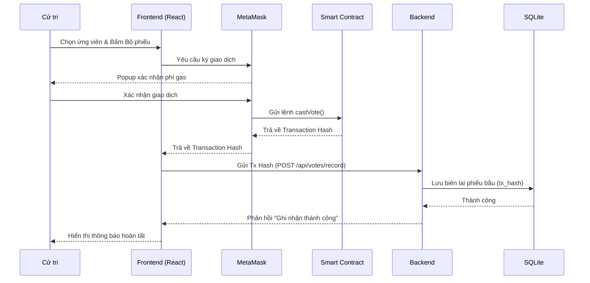

# TÀI LIỆU YÊU CẦU HỆ THỐNG - VOTECHAIN

## 1. BRD (Business Requirements Document) - Tài liệu Yêu cầu Nghiệp vụ

### 1.1. Bối cảnh
Các hệ thống bỏ phiếu truyền thống đối mặt với rủi ro gian lận, thiếu minh bạch trong khâu kiểm phiếu và chi phí vận hành cao. VoteChain ra đời để giải quyết các vấn đề này bằng công nghệ Blockchain.

### 1.2. Mục tiêu Nghiệp vụ
- **Minh bạch (Transparency)**: Cho phép cử tri tự kiểm tra phiếu bầu của mình trên Blockchain.
- **Bất biến (Immutability)**: Dữ liệu sau khi ghi không thể bị Admin hay bất kỳ ai sửa đổi.
- **Tự động hóa**: Tự động tổng hợp kết quả mà không cần sự can thiệp thủ công.

### 1.3. Lợi ích
- Tăng niềm tin của cộng đồng vào kết quả bầu cử.
- Giảm thời gian công bố kết quả từ vài ngày xuống còn vài giây sau khi kết thúc.

---

## 2. SRS (Software Requirements Specification) - Đặc tả Yêu cầu Phần mềm

### 2.1. Yêu cầu Hệ thống
- **Giao diện**: Web responsive (Chạy trên Mobile và Desktop).
- **Trình duyệt**: Hỗ trợ Chrome, Edge, Firefox và yêu cầu cài đặt Extension **MetaMask**.
- **Kết nối mạng**: Yêu cầu kết nối Internet để tương tác với mạng Sepolia Testnet.

### 2.2. Yêu cầu Phi chức năng
- **Bảo mật**: Sử dụng JWT cho phiên đăng nhập và Private Key cho các giao dịch on-chain.
- **Hiệu năng**: Load trang dưới 2 giây; Giao dịch blockchain hoàn tất trung bình sau 15 giây.
- **Khả năng mở rộng**: Có thể hỗ trợ hàng nghìn cử tri tham gia đồng thời.

---

## 3. FRD (Functional Requirements Document) - Tài liệu Yêu cầu Chức năng

### 3.1. Chức năng Quản trị (Admin)
- **Quản lý Bầu cử**: Tạo, chỉnh sửa và đóng các cuộc bầu cử.
- **Quản lý Ứng viên**: Thêm danh sách ứng viên cho từng cuộc bầu cử.
- **Theo dõi Hoạt động**: Xem các giao dịch (Transactions) thực tế đang diễn ra trên hệ thống.

### 3.2. Chức năng Cử tri (Voter)
- **Liên kết Ví**: Kết nối địa chỉ ví MetaMask với tài khoản hệ thống.
- **Bỏ phiếu**: Chọn ứng viên và ký xác thực giao dịch qua MetaMask.
- **Tra cứu**: Xem lại lịch sử phiếu bầu và mã băm (Vote Hash) để kiểm chứng.

### 3.3. Chức năng Hệ thống
- **Tự động tally**: Tự động tính toán số phiếu dựa trên dữ liệu on-chain.
- **Đồng bộ hóa**: Đồng bộ trạng thái giữa Smart Contract và Database SQLite.

---

## 4. Sequence Diagram - Sơ đồ Tuần tự (Luồng Bỏ phiếu)

---
*Tài liệu được tạo tự động để hỗ trợ quản lý dự án VoteChain.*
